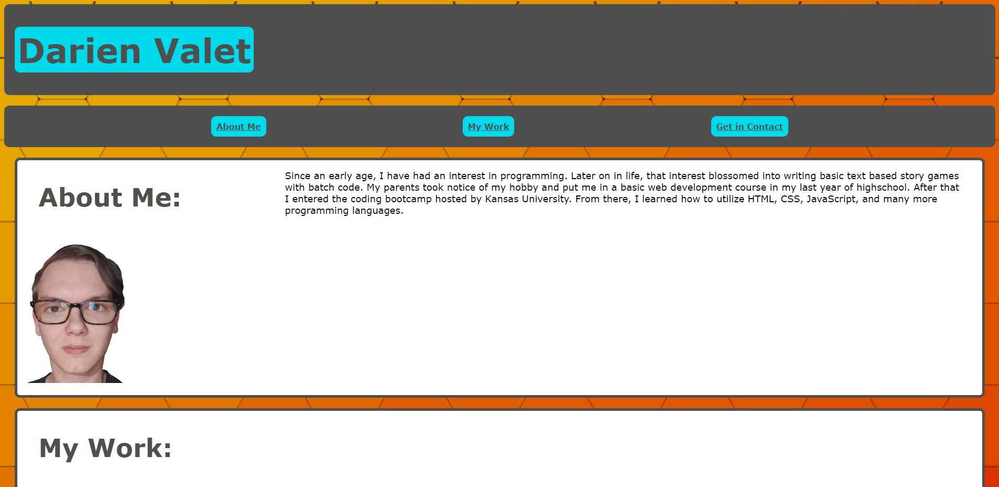

# Project Description
This is a project site built by Darien Valet as a digital portfolio. The site includes concepts I have learned in HTML, CSS, and CSS Flex. It is vary much still a rough project which will be refined as I learn more and more in the field of website development.

## Page Preview
When launched, the loaded webpage should have an appearance similar to the image below:

## Webpage Link:
> **Use this link to view the webpage:** [link to the Horiseon webpage](https://antimatternova.github.io/portfolioV1/)